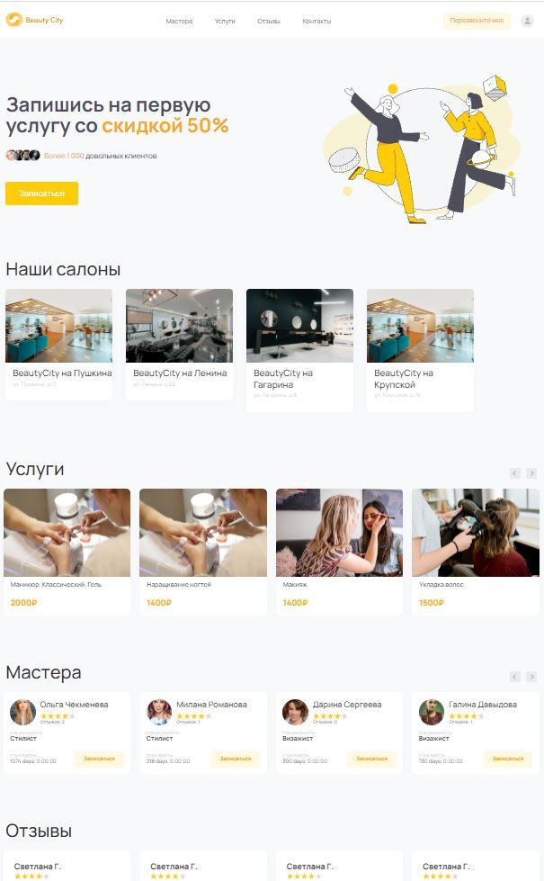

# Сайт салона красоты Beauty City

Это сайт сети салона красоты Beauty City. Здесь можно записаться на стрижку, макияж или маникюр к вашему любимому мастеру.



Сеть салонов красоты Beauty City объединяет несколько салонов. У всех салонов одинаковой набор услуг и цены.
Выберите салон, услугу, мастера и удобное для вас время из свободных и запишитесь.

### Сборка проекта

Скачайте код:
```sh
git clone https://github.com/permsky/beauty_city.git
```

Перейдите в каталог проекта:
```sh
cd beauty_city
```

Установите [Python3](https://www.python.org/), если этого ещё не сделали.

Проверьте, что `python` установлен и корректно настроен. Запустите его в командной строке:
```sh
python --version
```
**Важно!** Версия Python должна быть не ниже 3.6.

Возможно, вместо команды `python` здесь и в остальных инструкциях этого README придётся использовать `python3`. Зависит это от операционной системы и от того, установлен ли у вас Python старой второй версии.

В каталоге проекта создайте виртуальное окружение:
```sh
python -m venv venv
```
Активируйте его. На разных операционных системах это делается разными командами:

- Windows: `.\venv\Scripts\activate`
- MacOS/Linux: `source venv/bin/activate`


Установите зависимости в виртуальное окружение:
```sh
pip install -r requirements.txt
```

Примените миграции:
```sh
python manage.py migrate
```

Создайте файл `.env` со следующими настройками:

- `DEBUG` — дебаг-режим. Поставьте `True` для девелоперской версии;
- `SECRET_KEY` — секретный ключ проекта Django. Он отвечает за шифрование на сайте. В частности, им зашифрованы все пароли на вашем сайте. Не стоит использовать значение по-умолчанию, **замените на своё**;


Для получения ключа выполните в консоли команду:

`python manage.py shell -c "from django.core.management import utils; print(utils.get_random_secret_key())"`
- `ALLOWED_HOSTS` — [см. документацию Django](https://docs.djangoproject.com/en/3.1/ref/settings/#allowed-hosts);
- `STRIPE_API_KEY` — зарегистрируйтесь на [stripe.com](http://stripe.com) и впишите сюда [token](https://dashboard.stripe.com/test/apikeys). 

Запустите сервер:
```sh
python manage.py runserver
```

Перейдите по ссылке [http://127.0.0.1:8000/](http://127.0.0.1:8000/)

## Цели проекта

Код написан в учебных целях — это урок в курсе по Python и веб-разработке на сайте [Devman](https://dvmn.org).
